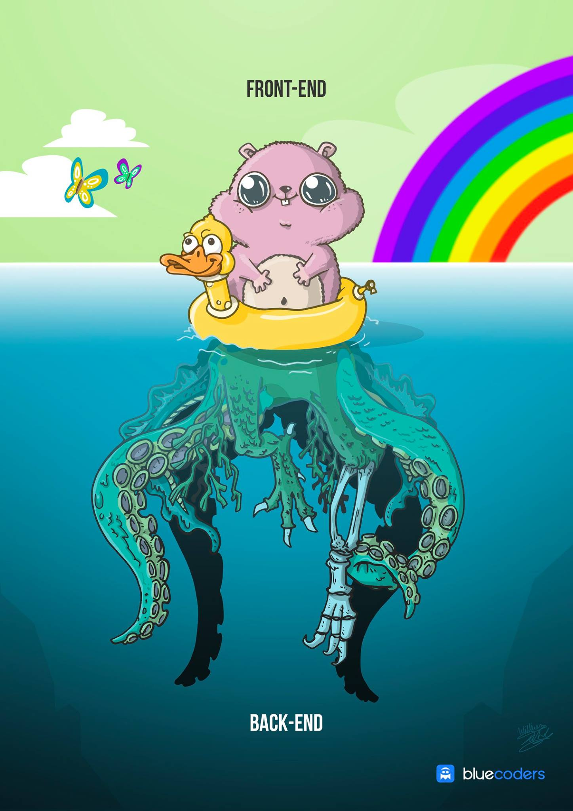

<!--
author:   Andrea Charão

email:    andrea@inf.ufsm.br

version:  0.0.1

language: PT-BR

narrator: Brazilian Portuguese Female

comment:  Material de apoio para a disciplina
          ELC1090 - Desenvolvimento de Software para Web
          da Universidade Federal de Santa Maria

translation: English  translations/English.md
-->

<!--
liascript-devserver --input README.md --port 3001 --live
https://liascript.github.io/course/?https://raw.githubusercontent.com/AndreaInfUFSM/elc1090-2025a/master/classes/17/README.md
-->

# Terceiro projeto

> Objetivo: Criar aplicação web com persistência de dados do lado do servidor

 
 
 > 

## Tema e requisitos

> Tema: compartilhamento

Requisitos, em linhas gerais:

- Implementar frontend que ofereça pelo menos um CRUD completo (Create-Read-Update-Delete) 
- Persistir os dados do lado do servidor
- Implementar login de usuário simplificado (sem autenticação real e com usuários pré-cadastrados)

## Recursos permitidos

- Bancos de dados relacionais ou não relacionais 
- Quaisquer frameworks / plataformas vistos na aula anterior, com maior ou menor nível de abstração
- Frontend: tudo o que foi permitido nos projetos anteriores
- Uso inteligente e declarado de IA

## Sugestões alinhadas com o tema

A seguir, algumas sugestões de funcionalidades / aplicações alinhadas com o tema e com os requisitos

### Compartilhamento de roadmaps

- Usuários cadastram seus "roadmaps" em formato Markdown (CRUD)
- Roadmaps de outros usuários podem ser listados / buscados / filtrados (compartilhamento de roadmaps)
- Opcional: conversão do formato Markdown para visualização em outro formato (grafo, cola)

### Compartilhamento de links / bookmarks

- Usuários cadastram URLs de interesse (CRUD)
- Links de outros usuários podem ser listados / buscados / filtrados (compartilhamento de links)
- Opcional: integração com bibliotecas / serviços que façam extração / classificação automática do conteúdo dos links

## Como?

- Trabalho em dupla

- Alternativas de desenvolvimento:

  1. default: seguir todas as recomendações de tema e recursos
  2. custom: propor outras ideias relacionadas ao tema, com validação pela professora

- Desenvolvimento incremental com commits frequentes

- Avanços demonstrados durante as aulas

- Deploy obrigatório!

## Entrega

- Repositório da dupla

  - Primeiro integrante da dupla que clicar no link vai criar um grupo
  - Segundo integrante da dupla vai clicar no link e selecionar o mesmo grupo
  - Clique no link a seguir para criar o repositório de entrega: https://classroom.github.com/a/Xahqjmnz

- Ambos integrantes devem fazer commits frequentes, seguindo boas práticas
- O repositório de entrega deve conter o código e [README](entrega/README.md) preenchido conforme o template
- O projeto deve ser apresentado pela dupla à professora
- Prazos:
  
  - Apresentação: 27/05/2025

## Avaliação

Rubricas de avaliação

<!-- data-type="none" -->
| Descrição   | Nota   |
| :--------- | :--------- |
| Trabalho alinhado com os objetivos e requisitos, com evidente empenho no processo e envolvimento da dupla | 10 a 12 |
| Trabalho com algumas limitações, mas com evidente empenho no processo | 7 a 9 |
| Trabalho muito limitado ou desequilibrado, mas mesmo assim demonstrando algum empenho no processo | 5 a 7 |
| Trabalho não entregue, ou com indícios de desonestidade acadêmica, ou feito de última hora (sem evidências de empenho e atenção às orientações)  | 0 a 5 |

Obs.: 

- Duplas com grande desnível de experiência devem se assegurar de que haja participação de ambas as partes 
- A nota pode ser individualizada em casos em que a entrega demonstrar empenhos muito distintos

